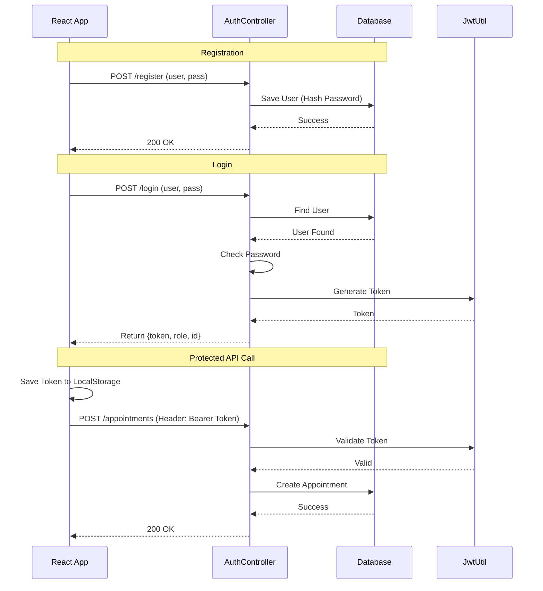

# Authentication Flow Explanation

This document explains how authentication is implemented in the Hospital Management System.

## 1. Overview
The system uses **JWT (JSON Web Token)** based authentication. This is a stateless method where the server generates a token upon login, and the client (React app) sends this token with every subsequent request to prove identity.

---

## 2. Key Components

### **A. `User` Entity (`User.java`)**
*   Represents a user in the database.
*   Stores `username`, `password` (encrypted), and `role` (`PATIENT`, `DOCTOR`, `ADMIN`).

### **B. `AuthController` (`AuthController.java`)**
*   **`/register`**: Accepts user details, creates a `User` entity, and saves it. It also automatically creates a `Patient` profile if the role is PATIENT.
*   **`/login`**: Accepts username/password. If valid, it uses `JwtUtil` to generate a token and returns it along with the user's role and ID.

### **C. `JwtUtil` (`JwtUtil.java`)**
*   **`generateToken(username, role)`**: Creates a signed JWT containing the username and role.
*   **`validateToken(token, username)`**: Checks if the token is valid and not expired.
*   **`extractUsername(token)`**: Decodes the token to get the user's identity.

### **D. `SecurityConfig` (`SecurityConfig.java`)**
*   Configures Spring Security.
*   **`passwordEncoder()`**: Uses `BCryptPasswordEncoder` to securely hash passwords before saving to the DB.
*   **`securityFilterChain`**: Defines which endpoints are public (e.g., `/auth/**`) and which require authentication.
    *   *Note: Currently, for development ease, it is set to allow all requests. In a production environment, this would be locked down to require the JWT token for API access.*

---

## 3. The Login Flow (Step-by-Step)

1.  **Client**: User enters username and password in the React Login page.
2.  **Request**: React sends a `POST` request to `http://localhost:8081/auth/login`.
3.  **Server (AuthController)**:
    *   Finds the user in the database.
    *   Checks if the password matches the hashed password using `BCrypt`.
4.  **Token Generation**:
    *   If password is correct, `JwtUtil` generates a long string (Token) that contains the user's info encrypted.
5.  **Response**: Server sends this Token back to the Client.
6.  **Client Storage**: React saves this Token in `localStorage`.

## 4. How Protected Requests Work

1.  **Client**: When the user wants to book an appointment, React retrieves the Token from `localStorage`.
2.  **Request**: React adds an `Authorization` header to the request:
    `Authorization: Bearer <token_string>`
3.  **Server**:
    *   Intercepts the request.
    *   Validates the token using `JwtUtil`.
    *   If valid, allows the request to proceed to the `AppointmentController`.
    *   If invalid (or missing), returns `403 Forbidden`.

---

## 5. Diagram

